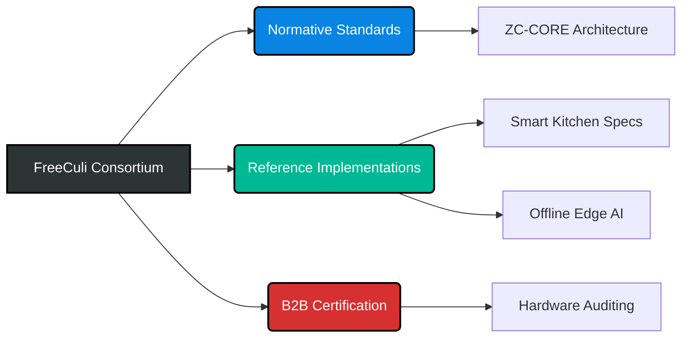

# 🛡️ FreeCuli Standards Organization

**The Global Authority for Zero-Cloud, Server-Independent Edge AI & Hardware Security Certification.**

 

> *"Implementation Freedom. Architectural Absolute Privacy."*
> 
> FreeCuli does not manufacture chips or enforce vendor lock-in. We are an **open-source consortium and certification body**. Hardware manufacturers are 100% free to choose their own silicon, programming languages, and components. We govern the *evidence-based physical security outcome*, not the supply chain.

---

## 🌍 The Consortium Mission
FreeCuli enforces the strict **ZC-CORE v3.2.1** standard. We empower hardware manufacturers to build fully functional, **Server-Independent** smart devices (from Smart Homes to Medical, Defense, and Industrial IoT) that operate **100% offline** by enforcing uncompromising, physical hardware trust boundaries.

 

## 🧭 Ecosystem & Navigation

### 🏛️ Normative Standards & Specifications
* 📖 **[ZC-CORE Hardware Reference Architecture](https://github.com/FreeCuli/zero-cloud-hardware-architecture)**
  *The official CERN-OHL-S licensed hardware blueprint for ZC-CORE v3.2.1 compliant AIoT devices.*

  **Core Pillars & Entry Points:**
  * 📜 **[Methodology Invariants](https://github.com/FreeCuli/zero-cloud-hardware-architecture/blob/main/zero-cloud-core-methodology-invariants.md)** - *The absolute DNA and normative technological rules (M1-M10).*
  * ⚔️ **[Attack Taxonomy](https://github.com/FreeCuli/zero-cloud-hardware-architecture/blob/main/zero-cloud-core-attack-taxonomy.md)** - *Classification of physical and side-channel threats mitigated by the standard.*
  * 🧪 **[Conformance Test Spec (CTS)](https://github.com/FreeCuli/zero-cloud-hardware-architecture/blob/main/zero-cloud-core-conformance-test-specification.md)** - *Physical laboratory procedures required to prove hardware compliance.*
  * 📊 **[Evidence Matrix](https://github.com/FreeCuli/zero-cloud-hardware-architecture/blob/main/zero-cloud-core-conformance-evidence-matrix.md)** - *Mapping of normative requirements to mandatory physical laboratory evidence.*
  * ⚖️ **[Dual-Licensing Framework](https://github.com/FreeCuli/zero-cloud-hardware-architecture/blob/main/zero-cloud-dual-licensing.md)** - *Open-source rules vs. Commercial Exemption (B2B) licensing models.*

### 🔬 Reference Implementations
* 🍳 **[Smart Kitchen Standards (HFSCA)](https://github.com/FreeCuli/smart-kitchen-standards)**
  * The application layer demonstrating how ZC-CORE is strictly implemented in smart home and kitchen appliances.
* 🧠 **[Smart Kitchen Offline Assistant](https://github.com/FreeCuli/smart-kitchen-offline-assistant)**
  * The open-source software/AI reference implementation of the FreeCuli Edge inference engine.

---

## 🏅 ZC-CORE Certification Tiers
We provide a 4-tier conformance framework for global hardware supply chains to verify their Zero-Cloud claims:

| Certification Level | Evidence Requirements | IP / Licensing |
| :--- | :--- | :--- |
| **1. Self-Declared** | Manufacturer claims adherence to ZC-CORE Invariants. No lab evidence provided. | Open-Source / Unlicensed |
| **2. Tested** | Internal lab evidence (CTS) is kept by the manufacturer. Not publicly audited. | Open-Source / Unlicensed |
| **3. Verified** | Independent third-party audit of hardware CTS evidence. | Requires Commercial Audit |
| **4. FreeCuli Certified™** | Full B2B integration. Hardware proudly carries the official trademarked badge. | Commercial B2B License |

---

## 🤝 Commercial & Certification Inquiries

Are you an AIoT, Defense, or Edge AI hardware manufacturer looking to build true Zero-Cloud compliant appliances and obtain the **FreeCuli ZC-CORE** certification badge?

Your hardware architecture must pass the adversarial constraints outlined in our **[Conformance Test Specification (FC-ZC-CTS v3.2.1)](https://github.com/FreeCuli/zero-cloud-hardware-architecture/blob/main/zero-cloud-core-conformance-test-specification.md)** and provide mandatory laboratory physical evidence proving sensor isolation.

Reach out to our core engineering team to discuss testing protocols, B2B dual-licensing, and technical integration.

> 🌐 **Website:** [FreeCuli.com](https://freeculi.com)  
> ✉️ **Contact:** [info@freeculi.com](mailto:info@freeculi.com)

   
  © 2026 FreeCuli. All rights reserved. ZC-CORE and the FreeCuli badge are trademarks of the FreeCuli Standards Organization.

